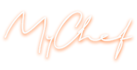

  

<h3 align="center">My Chef - App de receitas</h3>

  
  
  
  
  

---

 WebApp responsivo criado em React.
      

 

## 📝 Links

- [Sobre](#about)
- [Features](#feats)
- [Desenvolvimento](#deployment)
  - [Metodologia](#development)
  - [Tecnologias usadas](#built_using)
- [Authors](#authors)

 

# Sobre o projeto 

O projeto foi realizado ao longo de duas semanas, por um grupo de [5 pessoas](#authors) durante o curso de Desenvolvimento Web da [Trybe](https://www.betrybe.com).  
 O aplicativo consiste em um sistema que permite visualizar, buscar, filtrar, favoritar compartilhar e acompanhar o processo de preparação de receitas e drinks.    
Foram usadas 2 APIs distintas como base de dados: [TheMealDB](https://www.themealdb.com) para comidas e [TheCocktailDB](https://www.thecocktaildb.com/api.php) para bebidas.

 

# 🚀 Desenvolvimento 

## Metodologias
O desenvolvimento foi feito utilizando Kanban e metodologias ageis.    
O primeiro dia foi dedicado exclusivamente para planejamento, enquanto nos outros foram realizadas daily meetings para alinhamento.    
Foi utilizado o Trello para divisão de tarefas.
Também foi utilizado pair programming para solucionar problemas de forma mais rapida.
   

## ⛏️ Tecnologias Utilizadas 
- [React.js](https://www.mongodb.com/) - JavaScript Framework
  - React Context API
  - React Hooks
- [Bootstrap](https://getbootstrap.com) - CSS Framework
- [TheMealDB](https://themealdb.com) - Base de dados das comidas
- [TheCocktailDB](https://thecocktaildb.com/) - Base de dados dos drinks

 

# ✍️ Autores 

- [Lucas Flores](https://github.com/kylelobo) - Desenvolvimento em react
- [Pedro Fonseca](https://github.com/kylelobo) - CSS, design e estilização geral do projeto
- [Paula Tortato](https://github.com/kylelobo) - Desenvolvimento em react
- [Gerson Henrique](https://github.com/kylelobo) - Desenvolvimento em react
- [Guilherme Pavinato](https://github.com/kylelobo) - Escrita de testes 
